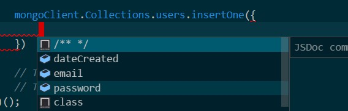

# Mongo io-ts wrapper

Strongly typed mongod db with runtime validation and typescript intellisense.

## Usage

Define your interfaces with [io-ts](https://github.com/gcanti/io-ts)

```typescript
import * as t from 'io-ts';

const User = t.interface({
    dateCreated: t.number;
    name: t.string;
    email: t.string;
});
```

Use mongo wrapper to define `users` collection

```typescript
const mongoClient = mongoWrapper({
    Collections: {
        users: User
    }
});
```

Get intellisense



Get runtime validation

`Invalid value "NotANumber" supplied to : { email: string
, dateCreated: number, password: string }/dateCreated: number`
